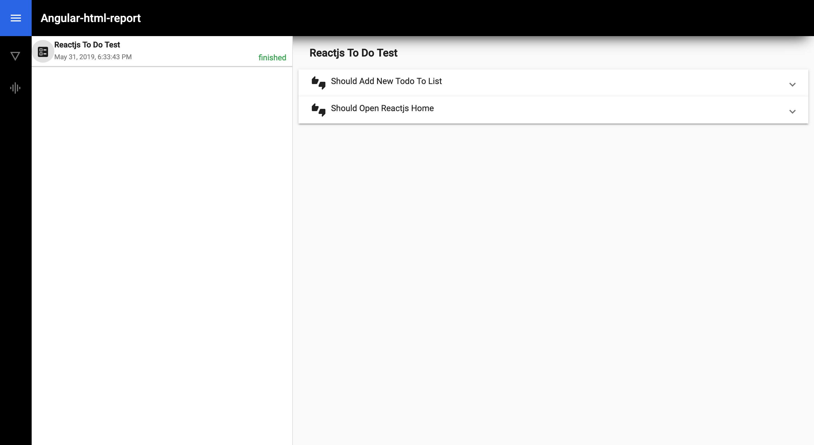

# protractor-jasmine2-html-cli-reporter

HTML reporter for Jasmine2 and Protractor that will include screenshots of each test if you want.
This work is an improvised version of :
* [HTML reporter for Jasmine2 and Protractor](https://github.com/Kenzitron/protractor-jasmine2-html-reporter) from [@Kenzitron](https://github.com/Kenzitron) 

It also combine the console reporting module: 

* [Progressive Console Reporter for Jasmine](https://github.com/onury/jasmine-console-reporter.git) from [@Onury](https://github.com/Onury)

This project combine cli and html reporting for Jasmine reporter. 

##screens:
###Dhashboard

###Graphs and info\

###Spec details

## Usage
The <code>protractor-jasmine2-html-cli-reporter</code> is available via npm:

<code>$ npm install protractor-jasmine2-html-cli-reporter --save-dev</code>

In your Protractor configuration file, register protractor-jasmine2-html-cli-reporter in jasmine:

<pre><code>var Jasmine2HtmlCliReporter = require('protractor-jasmine2-html-cli-reporter');

exports.config = {
   // ...
   onPrepare: function() {
      jasmine.getEnv().addReporter(
        new Jasmine2HtmlCliReporter({
          savePath: 'target/screenshots'
        })
      );
   }
}</code></pre>

## Options

### jasmine-console-reporter options
Use below option to enable <code>jasmine-console-reporter</code>
<pre><code>
   cliReport: {
    enabled: true,
    options:{} // this support all the options for https://github.com/onury/jasmine-console-reporter.git
  }
</code></pre>

### Destination folder

Output directory for created files. All screenshots and reports will be stored here.

If the directory doesn't exist, it will be created automatically or otherwise cleaned before running the test suite.

<pre><code>jasmine.getEnv().addReporter(new Jasmine2HtmlCliReporter({
   savePath: './test/reports/'
}));</code></pre>

Default folder: <code>./</code>

### Screenshots folder (optional)

By default the screenshots are stored in a folder inside the default path

If the directory doesn't exist, it will be created automatically or otherwise cleaned before running the test suite.

<pre><code>jasmine.getEnv().addReporter(new Jasmine2HtmlCliReporter({
   savePath: './test/reports/',
   screenshotsFolder: 'images'
}));</code></pre>

Default folder: <code>screenshots</code>

### Take screenshots (optional)

When this option is enabled, reporter will create screenshots for specs.

<pre><code>jasmine.getEnv().addReporter(new Jasmine2HtmlCliReporter({
   takeScreenshots: false
}));</code></pre>

Default is <code>true</code>

### Take screenshots only on failure (optional) - (NEW)

This option allows you to choose if create screenshots always or only when failures.
If you disable screenshots, obviously this option will not be taken into account.

<pre><code>jasmine.getEnv().addReporter(new Jasmine2HtmlCliReporter({
   takeScreenshots: true,
   takeScreenshotsOnlyOnFailures: true
}));</code></pre>

Default is <code>false</code> (So screenshots are always generated)

### FixedScreenshotName (optional)

Choose between random names and fixed ones.

<pre><code>jasmine.getEnv().addReporter(new Jasmine2HtmlCliReporter({
   savePath: './test/reports/',
   fixedScreenshotName: true
}));</code></pre>

Default is <code>false</code>

### FilePrefix (optional)

Filename for html report.

<pre><code>jasmine.getEnv().addReporter(new Jasmine2HtmlCliReporter({
   savePath: './test/reports/',
   fileNamePrefix: 'Prefix'
}));</code></pre>

Default is <code>nothing</code>

### Consolidate and ConsolidateAll (optional)

This option allow you to create a single file for each reporter.

<pre><code>jasmine.getEnv().addReporter(new Jasmine2HtmlCliReporter({
   consolidate: false,
   consolidateAll: false
}));</code></pre>

Default is <code>true</code>

### CleanDestination (optional)

This option, if false, will not delete the reports or screenshots before each test run. 

<pre><code>jasmine.getEnv().addReporter(new Jasmine2HtmlCliReporter({
   savePath: './test/reports/',
   cleanDestination: false
}));</code></pre>

Default is <code>true</code>

### showPassed (optional)

This option, if false, will show only failures. 

<pre><code>jasmine.getEnv().addReporter(new Jasmine2HtmlCliReporter({
   ....
   showPassed: false
}));</code></pre>

Default is <code>true</code>

### fileName (optional)

This will be the name used for the html file generated thanks to this tool.

<pre><code>jasmine.getEnv().addReporter(new Jasmine2HtmlCliReporter({
   ....
   fileName: 'MyReportName'
}));</code></pre>

Default is <code>htmlReport</code>

### fileNameSeparator (optional)

This will set the separator between filename elements, for example, prefix, sufix etc.

<pre><code>jasmine.getEnv().addReporter(new Jasmine2HtmlCliReporter({
   ....
   fileNameSeparator: '_'
}));</code></pre>

Default is <code>-</code>

### fileNamePrefix (optional)

Prefix used before the name of the report

<pre><code>jasmine.getEnv().addReporter(new Jasmine2HtmlCliReporter({
   ....
   fileNamePrefix: ''
}));</code></pre>

Default is <code>empty</code>

### fileNameSuffix (optional)

Suffix used after the name of the report

<pre><code>jasmine.getEnv().addReporter(new Jasmine2HtmlCliReporter({
   ....
   fileNameSuffix: ''
}));</code></pre>

Default is <code>empty</code>

### fileNameDateSuffix (optional)

Datetime information to be added in the name of the report. This will be placed after the fileNameSuffix if it exists.
The format is: YYYYMMDD HHMMSS,MILL -> 20161230 133323,728

<pre><code>jasmine.getEnv().addReporter(new Jasmine2HtmlCliReporter({
   ....
   fileNameDateSuffix: true
}));</code></pre>

Default is <code>false</code>
